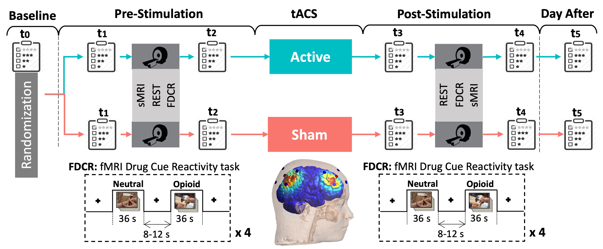

# Frontoparietal-tACS-OUD

## Overview
**Frontoparietal-tACS-OUD** is a code and analysis repository for a **randomized, triple-blind, sham-controlled clinical trial** investigating **frontoparietal dual-site transcranial alternating current stimulation (tACS)** in **opioid use disorder (OUD)**. The trial aims to characterize **neural target engagement** — specifically how frontoparietal network modulation alters large-scale brain activity and connectivity — using **pre- and post-stimulation functional MRI (fMRI)** including resting-state and drug cue reactivity paradigms.

This study was **pre-registered on ClinicalTrials.gov (Identifier: NCT03907644)**, titled *“Frontoparietal Synchronization to Modulate Drug Craving in Opioid Use Disorder”*. :contentReference[oaicite:0]{index=0}

---

## ClinicalTrials.gov Registration

This study was pre-registered on ClinicalTrials.gov to ensure transparency in study design,
intervention parameters, and outcome reporting.

| Field | Information |
|------|------------|
| ClinicalTrials.gov ID | **NCT03907644** |
| Study Title | Frontoparietal Synchronization to Modulate Drug Craving in Opioid Use Disorder |
| Study Type | Interventional (Clinical Trial) |
| Design | Randomized, triple-blind, sham-controlled |
| Intervention | Transcranial Alternating Current Stimulation (tACS) |
| Recruitment Status | Completed |
| Enrollment | ~60 participants |
| Sponsor | Laureate Institute for Brain Research, Inc. |
| Collaborator | Brain & Behavior Research Foundation |
| Study Location | Laureate Institute for Brain Research, Tulsa, OK |
| Primary Completion Date | June 15, 2023 |
| Study Completion Date | June 15, 2023 |

🔗 **ClinicalTrials.gov record:**  
https://clinicaltrials.gov/study/NCT03907644
---

## Scientific Rationale

Opioid use disorder involves dysregulated executive control and reward network dynamics, contributing to **craving, compulsive drug use, and relapse vulnerability**. tACS is a non-invasive brain stimulation modality that uses weak alternating current to modulate neuronal oscillations and network synchrony. Modulating the **frontoparietal executive control network** may influence downstream cortico-subcortical circuits implicated in craving and decision making.  

This trial’s design is grounded in mechanistic hypotheses: *enhanced frontoparietal synchrony may strengthen top-down regulatory control over reward circuits and alter cue reactivity responses measured via fMRI*.

---

## Study Design

- **Design:** Randomized, triple-blind (participants, clinicians, and assessors blind to condition), sham-controlled
- **Stimulation Paradigm:** Dual-site frontoparietal tACS
- **Session:** Single 20-minute stimulation session
- **Frequencies:** Theta-band (e.g., 4 Hz vs 7 Hz depending on condition)
- **Montage:** Synchronous stimulation at frontoparietal sites to engage executive network nodes
- **Primary Objective:** Characterize neural engagement via changes in BOLD activity and functional connectivity
- **Secondary Objectives:** Explore relationships between neural change and subjective craving (VAS, DDQ)

> Multiple clinical trials registered on ClinicalTrials.gov support tACS as a promising intervention for neuropsychiatric conditions, but the mechanisms and optimal parameters are still being defined (e.g., stimulation intensity, frequency, and montage). :contentReference[oaicite:12]{index=12}

---

## Outcomes & Measures

### **Primary Neural Measures**
- **Drug cue reactivity fMRI:** Block design task assessing BOLD response to opioid cues
- **Resting-state fMRI:** Connectivity within and between large-scale networks, including frontoparietal and reward circuits

### **Secondary Behavioral Measures**
- **Craving scales:**  
  - Visual Analog Scale (VAS)  
  - Desire for Drug Questionnaire (DDQ)

### **Exploratory Measures**
- Associations between **electric field models** and neural/behavioral outcomes
- Frequency-specific effects on network oscillatory dynamics

---

## Repository Structure

